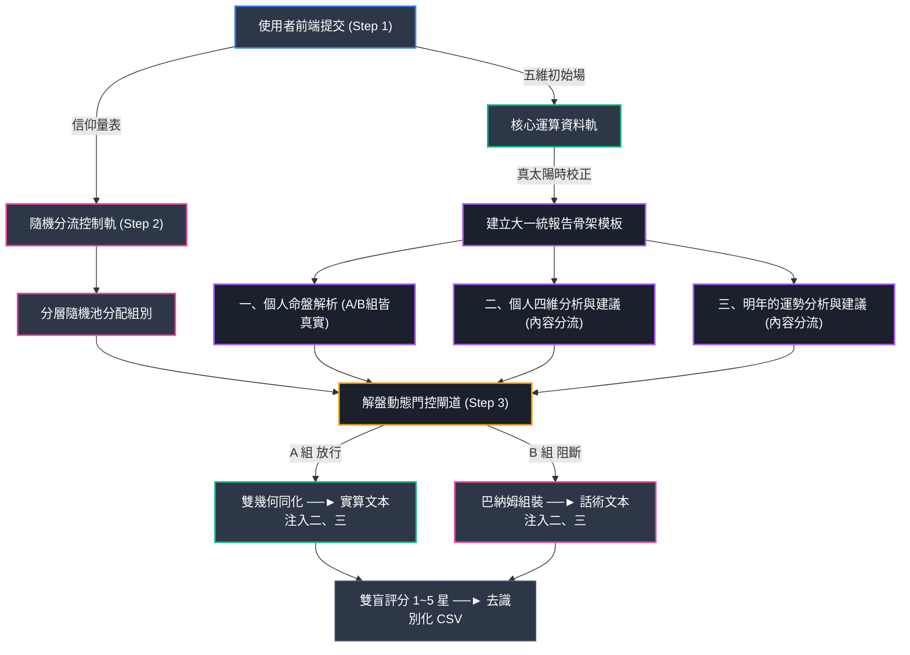

# 📡 反算命大師 (Anti-FortuneTeller Master)
> **「若天氣預報是一門科學，那東方命理能否走向數值分析模型？」**

## 🎯 一、 專題核心動機 (Project Motivation)

### 1. 哲學思辨：科學盡頭與未解科學的邊界
「科學的盡頭，是玄學。」這是許多人在觀察未知現象時常有的感嘆。然而，本專題試圖更進一步解構這個命題：如果此話成立，那麼現代所謂「尚未被理解的科學」，是否能完全等同於目前「定義上」的玄學？
假設目前定義上的玄學，本質上屬於未來「尚未被解碼的科學」，那麼要將玄學推向科學的範疇，就必須使用嚴謹的科學方法進行檢驗。
本專題選用兩套在東方文化中邏輯自洽、且承載千年歷史的命理系統：八字命理與紫微斗數。我們試圖以資料科學的視角，釐清這兩種傳統文化是否具備在未來成為科學一部分的潛力。

### 2. 關鍵提問：命理學能否走向「數值天氣預報」模式？
在中世紀，若有人能精準預測未來一週的天氣，極可能被視為女巫並送上火刑柱；但在 21 世紀，隨著流體動力學與熱力學（物理原理）、數值天氣預報（數學與電腦科學）、大氣觀測與初始場（資料同化），以及混沌理論與系集預報（不確定性科學）的加入，天氣預報已成為稀鬆平常的科學日常。
那麼，我們能不能夠用「天氣預報是怎麼被製作出來」的科學框架，來重新呈現這兩套東方命理文化？

### 3. 研究目標與科學痛點
對於玄學命理，開發者抱持「部分尊重、部分懷疑」的理性態度。能想到最合適的實證做法，便是利用逆向工程（Reverse Engineering）找出兩套東方玄學模型的「最大公因數」，並運用分層雙盲測試收集 100 名受測者真實反饋數據，最後引入 p-value 假設檢定，檢測數據是否具備統計學上的參考價值。
傳統命理學天生具有「無法證偽（Falsify）」的容錯機制（永遠存在例外處理、怎麼解讀都對）。同時，傳統 A/B 測試若未在源頭控制受測者的「信仰體質（干擾變數）」，極易因樣本隨機不均而導致實驗污染。
本專題採用純 Python 實作，在源頭導入嚴格的「分層隨機抽樣（Stratified Randomization）」，主動建立一套具備科學盲性的「雙盲 A/B 測試壓力模組」，用數據來檢驗這究竟是一場流傳千年的文字遊戲，抑或是一套尚未被解碼的資料科學規律。

---

## 🛠️ 二、 全系統雙軌架構設計 (System Dual-Pipeline Design)
本系統架構捨棄龐雜框架，採用純 Python 實作。當使用者在前端提交資料時，後端將啟動多執行緒處理，由「隨機分流控制軌（分層雙盲邏輯）」與「核心運算資料軌（雙幾何命理引擎）」並行交織。

### 📌 全系統多執行緒資料流向圖



*   **Step 1. 前端資料觀測與信仰分層 (初始場輸入)**：
    五維初始場數據（精確觀測）： 強制要求受測者輸入標準化的五維參數：(1) 西元出生年、(2) 月、(3) 日、(4) 時與分、(5) 出生地、(6) 生理性別。
    信仰分層（控制變數）： 填寫一題「命理信仰程度」的單選量表（0-4科學理性派｜5中立並尊重｜6-10玄學感性派），在源頭鎖定並隔離「迷信體質」這項最強大的干擾變數。
*   **Step 2. 後端分流控制軌 (分層隨機池)**：
    動態分層隨機池（Stratified Block Randomization）： 後端針對高、低信仰子母體分別建立獨立的隨機區組（Block Pool），強制確保其被分配到 A 組與 B 組的分母比例絕對是 1:1，杜絕因隨機不均帶來的統計偏誤。
    三盲思維與自動解盲機制： 受測者盲、分析者盲（後台隨機映射為 X/Y 編碼，跑完假設檢定後才解盲），並內建「開發者專專屬監控後門模式」，確保開發者的主觀期望不會干擾數據。
*   **Step 3. 核心運算資料軌與大一統外殼骨架 (排盤與分流注入)**：
    導入「模板方法模式」，制定了嚴格的「大一統報告骨架模板」。不論受測者最終走向哪一組，其拿到的報告排版、小標題、字數長度完全一致：
    *   **【一、個人命盤解析】區塊 (全體 100% 真實排盤 — 信度初始場)**：不論 A/B 組，皆執行真太陽時校正、八字四柱代數矩陣計算、紫微十二宮坐標映射幾何排盤，建立強烈的心理暗示。
    *   **【內容動態注入解盤閘道】**：
        *   **⚙️ A 組（實驗組文本）**：進行八字與紫微的跨模型資料同化（Data Assimilation），抓取兩者的交集（Ensemble Consensus），將實算結果注入骨架。
        *   **🧠 B 組（對照組文本）**：全面隔離資料軌。改調用後端「高級巴納姆心理學偽裝庫」，1:1 複製 A 組的四大章節小標題、引言格式與星曜術語外殼，去壓力測試人類大腦的代償邊界。

---

## 📊 三、 假說驗證矩陣 (Data Matrix)
收集完 100 位測試者的匿名數據後，專題將使用 Python scipy.stats 模組進行獨立樣本 T 檢定（Independent t-test）。我們以科學界公認的 p-value < 0.05 作為具備統計顯著性（Statistical Significance）的唯一判準：

*   **情境一：證偽成功 (A_mean ≈ B_mean 且均拿下高分)**：成功證明玄學本質為高明的巴納姆效應。人類大腦會主動代償並對號入座，底層玄學公式並不具備顯著的統計學意義。
*   **情境二：發現新大陸 (A_mean > B_mean 且 p-value < 0.05)**：證實真報告顯著優於假報告！高度支持「數值分析模型」類比假說，證明玄學具備資料科學的規律性。下一步將啟動資料探勘（Data Mining），抓出這 100 筆生辰數據中的最大公因數。
*   **情境三：終極諷刺 (A_mean < B_mean 且 p-value < 0.05)**：傳統公式全面失靈，心理學話術大獲全勝。證明算命產業高度依賴心理暗示與冷讀術。
*   **情境四：系統雜訊過大 (兩組評分無顯著差異 且 p-value ≥ 0.05)**：統計效能（Statistical Power）不足。可能源於 UI 易用性低落、報告文案具備攻擊性，或受限於 N=100 的小樣本分母。

---

## ⚠️ 開發者的自我審查 (Limitations)
專題結尾將附上嚴謹的科學盲點反思：若結果走向情境一或情境四，仍須聲明潛在的系統性偏誤——開發者本身對古典八字與紫微斗數古籍代碼的詮釋深度，可能在演算法降維轉換過程中產生了資訊遺失（Information Loss），無法 100% 還原人工解盤的複雜權重。

## 🚀 四、 開源工程師承諾 (Open Source Declaration)
📁 專案工程依賴與目錄拓樸 (Project Topology)
```text
Anti-FortuneTeller-Master/
│
├── README.md               # 您面前這份宏大且嚴謹的專題計畫書
├── main.py                 # 全系統多執行緒主控制流程
│
├── core/                   # 100% 原創編寫的核心實驗組件
│   ├── stratification.py   # Step 1. 前端信仰量表計分與初始場驗證
│   ├── randomization.py    # Step 2. 記憶體動態分層區組隨機池演算法
│   └── gate_control.py     # Step 3. 大一統報告模板與門控解盤填充機
│
└── vendor/                 # 源碼嵌入（Vendoring）基礎排盤輪子
    ├── lunar_python/       # 負責真實公農曆二十過節氣與真太陽時計算
    └── iztro_py/           # 負責真實紫微斗數十四主星二維空間矩陣映射
```
*   如何利用 **Git 版控時光機** 精準、乾淨且具備良好迭代軌跡地構建一個資料科學系統。
*   如何用純 Python 實現不需要資料庫的**動態分層隨機分配與源碼安全控制**。
*   如何以**統計學假設檢定的硬核代碼**為槓桿，去撬動、挑戰並檢視一個流傳千年的古老黑箱產業。
